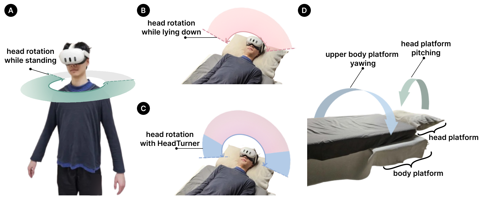
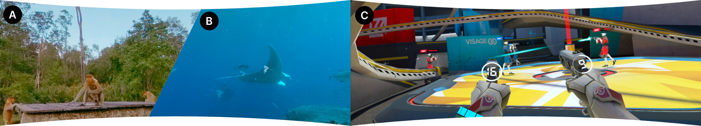
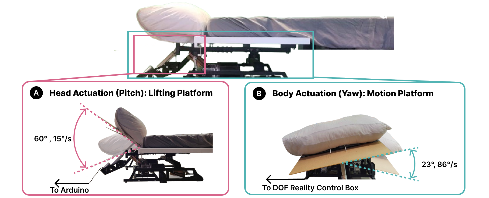
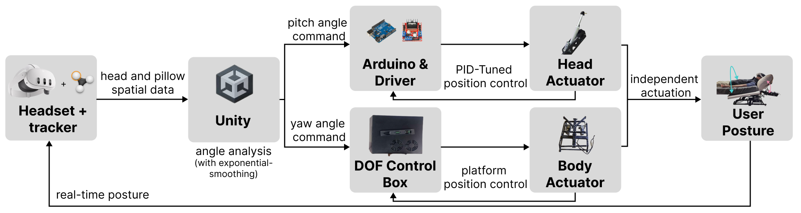
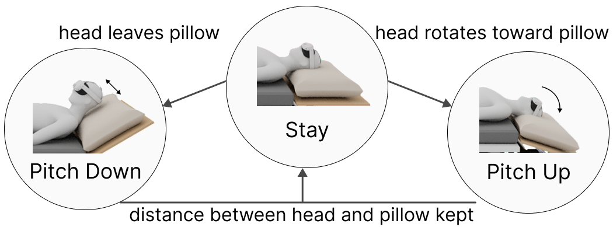

# HeadTurner
## Enhancing Viewing Range and Comfort of using Virtual and Mixed-Reality Headsets while Lying Down via Assisted Shoulder and Head Actuation ([ACM CHI 2025](https://dl.acm.org/doi/10.1145/3706598.3714214#fn1))


In the teaser figure, we demonstrate the viewing range in (A) standing posture, (B) in lying down posture, and (C) while lying down but with our approach embedded, we also briefly show the approach mechanism in (D).

---
## Overview
HeadTurner is an innovative system designed to improve comfort and viewing range for users of virtual and mixed reality (VR/MR) headsets, such as the Apple Vision Pro and Meta Quest, when used in reclined positions. As VR/MR technology evolves to accommodate various postures, HeadTurner addresses the ergonomic challenges associated with limited head and shoulder mobility while lying down. (you can watch the 1-min demo video by clickng the video preview below)
<p align="center">
  <a href="https://www.youtube.com/watch?v=xwc27_D9JpM">
    
  </a>
</p>

---
## Key Features
* **Adaptive Surface Actuation:** HeadTurner assists user-initiated head rotations by dynamically adjusting the resting surface in pitch and yaw axes, facilitating a more natural range of motion.​

* **Enhanced Viewing Range:** In user studies, HeadTurner significantly expanded the horizontal field of view from 130º to 261º and the vertical field from 94.9º to 172º, compared to a fixed surface.​

* **Improved Comfort:** Participants reported increased comfort during extended VR/MR sessions, with 75% preferring HeadTurner over traditional setups.

---
## User Impact
By enabling more natural head movements in reclined positions, HeadTurner enhances the immersive experience of VR/MR applications, reducing physical strain and increasing accessibility for users who prefer or require lying down.

---
## Potential Applications
* **Healthcare and Rehabilitation:** Facilitates VR-based therapies for patients confined to beds, offering engaging and comfortable experiences.​

* **Entertainment:** Enhances comfort for users engaging in extended VR gaming or media consumption sessions while reclining.​

* **Work and Education:** Supports professionals and students who utilize VR/MR for remote collaboration or learning in various postures.

> In our user study, we tested the HeadTurner system in hemispherical 360 videos, and first-person shooter game to validate the system's performance. 


---
## Usage

This repository includes hardware control logic, experimental datasets, a Unity-based virtual scene, and analysis code for replicating and extending the HeadTurner system. To explore and run parts of the system:

1. Clone the repository:
    ```
    git clone https://github.com/ntu-hci-lab/HeadTurner.git  
    cd HeadTurner
    ```
2. Open the Unity project:

    - Navigate to the `Unity_Integration/` folder.  
    - Open the Unity project with version 2022.3 LTS or later.

3. Run hardware tests (motor platforms or EMG):

    - Refer to Arduino scripts in `Motion_Platform/` and `Head_Platform/`.  
    - Ensure you set the correct control board and communication port.

4. Analyze experiment data:

    - Use `Application_Analysis/`, `Formative_Data/`, `Summative_Data/`, and `EMG_Analysis/` to review results or run your own analysis.  
    - Analysis scripts are mainly provided in Python or R with annotations for reproducibility.

---
## Repository Structure

- `Unity_Integration/`: Unity project files for real-time demonstration of the whole interaction system in the VR scene.  
- `Motion_Platform/`: Unity project files for UI-based testing interface controlling body-yawing motion platform.  
- `Head_Platform/`: Arduino scripts and CAD models for PID control and 3D printing of pillow-pitching linear actuator.  
- `Application_Analysis/`: R Data analysis scripts for head rotation data in third-party commercial apps.  
- `Formative_Data/`: Raw and processed data from the initial posture comparison study.  
- `Summative_Data/`: Evaluation results from the final user study comparing fixed vs. adaptive support.  
- `Summative_StarrySky_Constellations/`: A custom VR scene demonstrating a starry-sky viewing interactive animation.  
- `EMG_Test/` & `EMG_Analysis/`: Arduino and Python scripts for EMG signal-processing, measuring muscle construction level.  
- `Figures_For_Readme/`: Illustrations and figures for documentation and presentation.  
- `.gitignore`, `.gitattributes`: Git configuration files.  
- `LICENSE`: Licensing terms.  
- `README.md`: Project overview and usage guide.

---
## System Architecture


The HeadTurner system consists of two coordinated actuation components:

- **Yaw Actuation (Body Support):** A motion platform under the backrest that rotates left or right for the upper body, follows the user’s horizontal head rotations, enabling a wider effective field of view.

- **Pitch Actuation (Head Support):** A lifting platform that tilts the pillow surface up or down to accommodate forward or backward head motions, maintaining comfortable head-to-pillow contact.



The two subsystem modules work independently and collaboratively, from sensing user-initiated head movements to assisting them by adjusting the supporting surface, minimizing user effort while maximizing range of motion.



The newest version of the head platform uses a non-linear state transition model as the control strategy, enabling hybrid angle-distance sensor fusion.

---
## Future Developments
While the current prototype is designed as a bed, the underlying approach of HeadTurner can be adapted to more compact and affordable form factors, such as motorized reclining chairs, broadening its applicability across different settings.

Beyond reclining setups, HeadTurner opens the door to innovative applications across multiple domains:

- **Accessible gaming:** Providing enhanced comfort and interaction for players with limited mobility.

- **Assistive technology for the elderly:** Supporting long-term use of immersive media or remote communication while reclining.

- **Healthcare and rehabilitation:** Enabling adaptive physical therapy setups or sensory augmentation environments.

- **Human-computer interaction research:** Serving as a testbed for exploring embodied interaction, adaptive surfaces, or biofeedback systems.

HeadTurner serves as a significant step toward more ergonomic and accessible VR/MR experiences in reclined positions. By addressing the limitations of head and shoulder mobility, it opens new possibilities for immersive applications across healthcare, entertainment, accessibility, and research sectors.

> Feel free to contribute to the project by submitting issues or pull requests. For any questions or suggestions, please contact [slime52ray@gmail.com].
